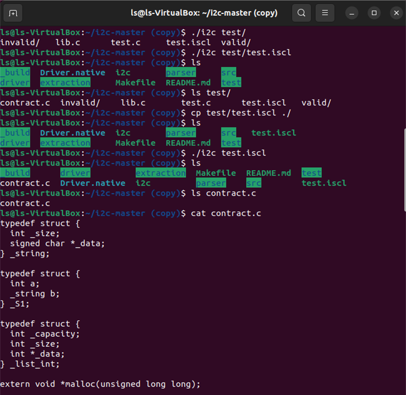
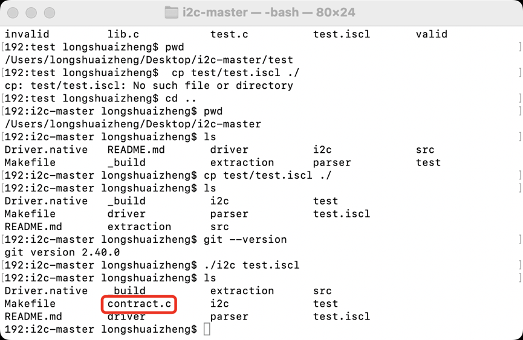

# isCL新型智能合约语言用户手册

## 概述
### 背景
智能合约随着区块链技术的应用在实际生活中起到了越来越重要的作用，然而由智能合约的漏洞所带来的损失数以亿计。以太坊Solidity语言作为第一个大规模用于区块链应用开发的专用智能合约语言，存在重入、哈希依赖、异常处理错序、危险库调用、溢出等多种问题。其中，美链BEC代币由于整数溢出导致64亿人民币蒸发，DAO攻击利用重入导致函数执行顺序改变盗走1亿5千万美元，Gas（费用）机制的引入导致攻击者可以滥用交易所Gas。根据安全公司Hosho报告，25%的以太坊智能合约存在漏洞，其导致半年损失27亿美元；60%的以太坊智能合约出现设计缺陷；全球有超过30万人或组织在攻击区块链。

过于灵活的语法、合约实现不规范、合约性质不易验证、参与者无法理解合约逻辑、智能合约编译器和虚拟机存在漏洞等都直接或间接地影响了智能合约的落地应用，安全性带来的劣势掩盖了灵活性带来的优势，限制了它的发展。因此，中科院软件所RepChain区块链项目组面向区块链常见应用场景，主要满足RepChain的实际应用需求，其次尽可能满足以太坊常见智能合约的开发需求，研究一套领域专用的智能合约编程语言isCL（Institute of Software Contract Language）。通过移除不必要的语法从根源上避免部分智能合约的漏洞，同时封装开发智能合约时所需要的常用操作，使得智能合约更加安全、简洁和可读。

### 语言特点
isCL智能合约语言定位为一种安全、简洁的非图灵完备的领域专用语言，面向智能合约相关业务的开发，该智能合约语言的特点如下：
#### 严格语义
对智能合约语言核心翻译步骤中的AST（Abstract Syntax Tree，抽象语法树）都赋予其明确的语义，既可以明确语法的执行效果，又可以采用Coq证明翻译过程的语义保持性，防止“误编译”的产生。
#### 静态检查
isCL智能合约语言依赖严格的类型系统和多种检查项的前端，在编译期就能检查出绝大部分错误。除常见的前端检查外，i2c编译器前端具备以下特点：

- 类型检查：在编译器前端对智能合约代码进行严格的类型检查，对类型不匹配的操作在编译阶段进行报错反馈，保证翻译后的代码一定是类型良好的；

- 终止性检查：智能合约语法中的循环语句只能针对迭代数据结构进行遍历，从而限制开发者写出无限循环的语句，另外禁止函数递归和函数循环递归，二者保证合约的可终止性；

- 杜绝空值：当一个变量没有初始值时，编译器将赋予一个该类型所对应的默认值，以防止合约方法中一个变量还未初始化便被使用，避免不可预测的程序执行结果。
#### 分布式一致性
分布式一致性即同一智能合约在不同的机器上运行的结果是一致的，以此来达成共识。通过禁止未允许的第三方库的引入，既防止了引入的代码包含危险操作影响合约逻辑的安全，又避免了第三方库中读取本地时间、文件和生成随机数等操作带来分布式不一致。
#### 轻量
编译智能合约生成的目标语言（C语言）相对底层，生成的可执行文件运行时速度快、占用内存相对其他语言较少，相比其他智能合约语言生成的可执行文件更加轻量。
#### 语义保持性
将对核心翻译步骤采用定理证明的方法证明其语义保持性，确保了翻译过程的安全性，实现可信编译，目前已完成部分核心阶段的语义定义和语义保持性证明。
#### 易用和可读
isCL语言语法在设计时针对智能合约开发的常用操作进行了优化，例如对数据结构的运算引入了运算符的重载、对状态数据的读写引入了状态变量的概念等，简化了智能合约逻辑的表达，也提升了智能合约的可读性。

## 环境搭建
### Ubuntu 22.04
``` bash
apt update  //更新apt软件包清单信息，并以此更新本地软件仓库
apt install -y vim git make opam //安装vim、opam

opam -y init //opam初始化
test -r /root/.opam/opam-init/init.sh && . /root/.opam/opam-init/init.sh > /dev/null 2> /dev/null || true //测试opam 命令
opam switch create 4.11.2 //选择 4.11.2版本
opam install -y coq=8.12.0 ocamlbuild //安装8.12.0版本的coq

opam repo add coq-released https://coq.inria.fr/opam/released //添加opam源
opam update //更新opam
opam install -y coq-compcert //安装coq-compcert

cd ~ //返回用户主目录
echo "eval `opam env`" >> .bashrc //写入启动设置文件
source .bashrc  //环境配置生效

git clone https://gitee.com/BTAJL/i2c //获取项目
cd i2c/ //进入项目目录
make //编译以得到i2c编译器
./i2c examples/hello.iscl  //使用i2c编译器编译合约文件，生成contract.c文件
```
注 :  test.iscl 是用户自定义合约文件，执行 ./i2c test.iscl 语句可生成.c文件contract.c。 

运行界面：



### MacOS Ventura 13.3
``` bash
brew update //更新brew软件包清单信息，并以此更新本地软件仓库
brew install vim git make opam //安装vim、opam

opam init //opam初始化
test -r /root/.opam/opam-init/init.sh && . /root/.opam/opam-init/init.sh > /dev/null 2> /dev/null || true //测试opam 命令
opam switch create 4.11.2 //选择 4.11.2版本
opam install coq=8.12.0 ocamlbuild //安装8.12.0版本的coq

opam repo add coq-released https://coq.inria.fr/opam/released //添加opam源
opam update  //更新opam
opam install coq-compcert //安装coq-compcert

cd ~ //返回用户主目录
echo "eval `opam env`" >> .bashrc  //写入启动设置文件
source .bashrc  //环境配置生效

git clone https://gitee.com/BTAJL/i2c //获取项目
cd i2c/ //进入项目目录
make //编译以得到i2c编译器
./i2c examples/hello.iscl  //使用i2c编译器编译合约文件，生成contract.c文件
```
运行界面：

注意：以上界面截图与实际情况可能有所出入

配置环境视频：
https://iscas1-my.sharepoint.cn/:v:/g/personal/zhengls_iscas1_partner_onmschina_
cn/ETm6h0ThpQRIhIvF1NmZ_oIBnKyTzH2DXFNCnKq9XUEwVw?e=MoGoYh

注意：以上演示视频与实际情况可能有所出入。

## 部署
目前支持将isCL语言编写的智能合约编译部署到RepChain区块链中，具体方法请参考开源工具i2w(https://gitee.com/BTAJL/i2w.git)。
## 语法
### 标识符
标识符指用户定义的常量名、变量名、函数名等，用户定义的标识符应符合以下要求：

- 只能由大小写英文字母、数字、下划线组成；
- 第一个字符必须是大小写英文字母；
- 全局环境中的标识符（包括结构体名、全局常量名、函数名等）不可重复；
- 禁止使用C语言和isCL语言的关键字作为标识符。


### 类型
isCL语言支持布尔、整数、浮点数、字符串、选项、列表、映射、结构体共8种类型。
#### 布尔类型

| 说明  | Bool   |
|---------------------|----------------------|
| 取值范围                | true, false          |
| 默认值                 | false                |
| 一元操作符               | !                    |
| 二元操作符               | &&, ==, !=, &#124; &#124; ||  |
| 取值操作符               | 无                    |
| 内置函数                | 无                    |
| 备注                  | 无                    |

实例：
```scala
1  b1: Bool = true;
2  b2: Bool;
3	
4  b2 = !b1;
5  b2 = b1 && b2;
6  b2 = b1 || b2;
7  b2 = b1 == b2;
8  b2 = b1 != b2;
```
#### 整数类型
本合约语言不支持null，因此在定义变量没有但没有初始化时，编译器会赋予该变量默认值。

| 说明    | Int           |
|-------|-------------|
| 取值范围  | -2^31 ~ 2^31 - 1 |
| 默认值   | 0   |
| 一元操作符 | -          |
| 二元操作符 | +, -, *, /, %, ==, !=, <, >, <=, >= |
| 取值操作符 | 无           |
| 内置函数  | 无           |
| 备注    | 除0，模0将触发异常          |

实例：
```scala
1  i1: Int = 2;
2  i2: Int = 1;
3  i3: Int;
4  b1: Bool;
5	
6  i3 = -i1;
7  i3 = i1 + i2;
8  i3 = i1 – i2;
9  i3 = i1 * i2;
10 i3 = i1 / i2;
11 i3 = i1 % i2;
12 b1 = i1 == i2;
13 b1 = i1 != i2;
14 b1 = i1 < i2;
15 b1 = i1 > i2;
16 b1 = i1 <= i2;
17 b1 = i1 >= i2;
```
#### 浮点数类型

| 说明    | Double              |
|-------|-------------------------------------|
| 取值范围  | -1.79E308 ~ 1.79E308                  |
| 默认值   | 0.0                                   |
| 一元操作符 | -                                   |
| 二元操作符 | +, -, *, /, ==, !=, <, >, <=, >= |
| 取值操作符 | 无                                   |
| 内置函数  | 无                                   |
| 备注    | 除0.0将触发异常                          |

实例：

```scala
1  d1: Double = 4.0;
2  d2: Double = 2.0;
3  d3: Double;
4  b1: Bool;
5	
6  d3 = -d1;
7  d3 = d1 + d2;
8  d3 = d1 - d2;
9  d3 = d1 * d2;
10 d3 = d1 / d2;
11 b1 = d1 == d2;
12 b1 = d1 != d2;
13 b1 = d1 < d2;
14 b1 = d1 > d2;
15 b1 = d1 <= d2;
16 b1 = d1 >= d2;
```
#### 字符串类型

| 说明    | String             |
|-------|-------------------------------------|
| 取值范围  | 无                |
| 默认值   | 空字符串                                   |
| 一元操作符 | 无                                 |
| 二元操作符 | +           // 字符串拼接<br/>==, !=   // 字符串比较|
| 取值操作符 | [ : ]        // 字符串截取                               |
| 内置函数  | len()      // 字符串长度                                   |
| 备注    | 字符串截取越界将触发异常                          |

实例：

```scala
1  str1: String = “abc”;
2  str2: String = “def”;
3  str3: String;
4  i1: Int;
5  b1: Bool;
6	
7  b1 = str1 == str2;
8  b1 = str1 != str2;
9  str3 = str1 + str2;
10 str3 = str1[0: 1];
11 i1 = str1.len();
```
#### 选项类型

| 说明    | Option             |
|-------|-------------------------------------|
| 取值范围  | 无                |
| 默认值   | none                                 |
| 一元操作符 | 无                                 |
| 二元操作符 | 无|
| 取值操作符 | 无                      |
| 内置函数  | get(), isEmpty()                                   |
| 备注    | 值为none时调用get()将触发异常                        |

实例:
```scala
1  o1: Option[Int] = some(1);
2  o2: Option[Int] = none;
3  i1: Int;
4  b1: Bool;
5	
6  i1 = o1.get();
7  b1 = o2.isEmpty();
```
#### 列表类型

| 说明    | List             |
|-------|-------------------------------------|
| 取值范围  | 无                |
| 默认值   | 空列表                                  |
| 一元操作符 | 无                                 |
| 二元操作符 | +         // 列表拼接|
| 取值操作符 | [ ]        // 列表赋值、取值                             |
| 内置函数  | len()    // 列表长度                                   |
| 备注    | 索引值类型为Int；<br/>    列表赋值、取值越界将触发异常                     |


实例 :
```scala
1  l1: List[Int] = List[Int](1, 2, 3);
2  l2: List[Int] = List[Int](4, 5, 6);
3  l3: List[Int];
4  i1: Int;
5	
6  l3 = l1 + l2;
7  i3 = l1.len();
8  i1 = l1[0];
9  l1[2] = 4;
```
#### 映射类型

| 说明    | Map             |
|-------|-------------------------------------|
| 取值范围  | 无                |
| 默认值   | 空映射                                   |
| 一元操作符 | 无                                 |
| 二元操作符 | +         // 映射拼接|
| 取值操作符 | [ ]        // 映射赋值、取值                               |
| 内置函数  | len()    // 映射长度                                   |
| 备注    | 索引值类型为Int或String；<br/>映射赋值时类型为Value的类型；<br/>映射取值时类型为Value类型对应的Option类型                     |

实例:
```scala
1  m1: Map[Int, String] = Map[Int, String](1: “a”, 2: “b”);
2  m2: Map[Int, String] = Map[Int, String](3: “c”, 4: “d”);
3  m3: Map[Int, String];
4  s1: String;
5  o1: Option[String];
6	
7  m3 = m1 + m2;
8  i1 = m1.len();
9  o1 = m1[1];
10 m2[5] = “e”;
```
#### 结构体类型

| 说明    | Struct             |
|-------|-------------------------------------|
| 取值范围  | 无                |
| 默认值   |成员变量按各自类型所对应的默认值初始化                                  |
| 一元操作符 | 无                                 |
| 二元操作符 | 无|
| 取值操作符 | .          // 结构体赋值、取值                              |
| 内置函数  | 无                                   |
| 备注    | 无                         |

```scala
1  // struct StructType1(i: Int, str: String);
2  s1: StructType1 = StructType1(1, “ok”);
3  i1: Int;
4  str1: String = “fail”;
5
6  i1 = s1.i;
7  s1.str = str1;
```
### 程序
isCL语言程序由结构体块、上下文变量块、状态变量块、全局常量块以及函数块五个模块构成。此外，模块应按上述顺序依次定义，不可改变顺序、不可穿插使用。
#### 结构体块
- 结构体块（struct block）是定义结构体的模块，包含结构体定义语句；
- 结构体定义语句以struct关键字开头；
- 结构体可嵌套定义。

实例：
```scala
1  struct StructType1(i: Int, str: String);
2  struct StructType2(j: Int, s: StructType1)
```
#### 上下文变量块
- 上下文变量块（context block）是声明上下文变量的模块，包含上下文变量声明语句；
- 上下文变量声明语句以context关键字开头；
- 上下文变量声明语句目前仅支持sender变量，含义是交易发起者的账户地址；
- 上下文变量可像普通变量一样使用，但不能对其进行赋值。
实例：
```scala
1  context sender: String;
```
#### 状态变量块
- 状态变量块（storage block）是定义合约状态变量的模块，包含状态变量定义语句；
- 状态变量定义语句以storage关键字开头；
- 状态变量在合约运行时从区块链读入，在合约正常结束后写回区块链；
- 状态变量可像普通变量一样使用。
```scala
1  storage istor: Int;
2  storage mstor: Map[String, String];
```
#### 全局常量块
- 全局常量块（const block）是声明全局常量的模块，包含全局常量定义语句；
- 全局常量定义语句以const关键字开头；
- 全局常量定义语句必须使用常量值初始化。
```scala
1  const B: Int = true;
2  const L: List[Int] = List[Int](1, 2, 3);
```
#### 函数块
- 函数块（function block）是定义函数的模块，包括函数定义；
- 函数定义以func关键字开头；
- 函数可以包含0或多个参数、0或1个返回值，并指明其类型；
- 花括号内为函数体，包含多条语句。
```scala
1  func f(a1: Int, a2: Int) = {
2    ……
3  }
4 
5  func g(): List[String] = {
6    ……
7  }
```
### 语句
isCL语言函数体包括本地常量定义语句、本地变量定义语句和其他语句。各类语句应按上述顺序依次定义，不可改变顺序、不可穿插使用。
#### 本地常量定义语句
- 本地常量定义语句以const关键字开头，用于定义本地常量；
- 本地常量定义语句必须使用常量值初始化。

实例：
```scala
1  const B: Int = true;
2  const L: List[Int] = List[Int](1, 2, 3);
```
#### 本地变量定义语句
- 本地变量定义语句用于定义本地变量；
- 本地变量定义语句可以初始化，也可以不初始化使用默认值。
实例：
```scala
1  o: Option[String];
2  s: S = S(0, “123”);
```
#### 赋值语句
- 赋值语句以“=”表示赋值，对“=”右侧的表达式求值，并赋予“=”左侧的表达式；
- 赋值语句为值传递，非引用传递；
- 赋值语句支持任意类型的直接赋值；
- 赋值语句“=”左侧被赋值的表达式只能是变量表达式、列表赋值表达式（[ ]）、映射赋值表达式（[ ]）、结构体赋值表达式（.）；
- 赋值语句“=”右侧表达式的值不会发生改变；
- 表达式不可脱离语句单独出现。
实例：
```scala
1  i = 1 + 2;
2  l[2] = 3;
3  m[“1”] = “abc” + “def”;
4  s.i = 1;
```
#### 条件语句
- 条件语句（if-else语句）表示当满足一定条件时，执行语句；
- 条件语句的判断表达式应为布尔类型；
- 条件语句至少有1个if语句块、0或多个else if语句块、0或1个else语句块。
实例：
```scala
1  if(i == 1) {
2    ……
3  } else if(i == 2) {
4    ……
5  } else {
6    ……
7  }
```
#### 循环语句
- 循环语句（for语句）表示对List或Map类型变量的循环操作；
- 每次循环按顺序取List或Map类型变量中的一个元素值；
- 不支持其它形式的循环语句；
- 被循环的List或Map类型变量在循环体内不可改变，即不可出现在赋值语句的“=”左侧的被赋值的表达式。
实例：
```scala
1  for(i in l) {
2    ……
3  }
4	
5  for(k, v in m) {
6    ……
7  }
```
#### 函数调用语句
- 函数调用语句用于调用用户定义的函数；
- 定义在前的函数无法调用定义在后的函数；
- 不可递归调用，也不可循环递归调用；
- 参数和返回值传递为值传递，非引用传递。
实例：
```scala
1  f(1, 2);
2  l = g();
```
#### 返回语句
- 返回语句（return语句）从当前函数退出；
- 返回语句可携带0或1个返回值。

实例：
```scala
1  return;
2  return false;
```
#### require语句
- require语句用于检查是否满足条件；
- require语句如果满足条件继续执行合约，如果不满足条件抛出异常，终止合约的执行；
- require语句支持定义错误信息；
- require语句第一个表达式应为布尔类型，第二个表达式应为字符串类型。
实例：
```scala
1  require(i == 0, “i is not equal to 0”);
```
### 其他
#### 注释
- 注释在编译时将被编译器忽略；
- 支持单行注释和多行注释。

实例：
```scala
1  // comment 1
2  /* comment 2 */
```
#### 异常
- 异常（exception）指程序执行中出现的问题，使得程序无法继续执行下去；
- 异常发生后，程序立刻终止并回滚；
- 除0、模0、对none使用get等都会造成异常；
- require语句也可抛出异常。

## 合约实例
### 存证
```scala
1  storage proof: Map[String, String];
2  func putProof(key: String, value: String) = {
3  proofOption: Option[String] = proof[key];
4  require(proofOption.isEmpty(), "Already existed value for key: " + key);
5  proof[key] = value;
6  }
```
### 转帐 
```scala
1  context sender: String;
2
3  storage ledger: Map[String, Int];
4  storage owner: String;
5	
6  func init(balance: Int) = {
7  require(owner == "", "Error: the init function already be called");
8  ledger[sender] = balance;
9  owner = sender;
10 }
11	
12  func mint(amount: Int) = {
13    newBalance: Int;
14    balanceOption: Option[Int];
15    require(owner == sender, "Error: the mint function must be called by the owner");
16    balanceOption = ledger[sender];
17    newBalance = balanceOption.get() + amount;
18    ledger[sender] = newBalance;
19  }
20	
21  func transfer(recipient: String, amount: Int) = {
22    balanceOfSpender: Int;
23    newBalanceOfSpender: Int;
24    balanceOfSpenderOption: Option[Int] = ledger[sender];
25	
26    balanceOfRecipient: Int;
27    newBalanceOfRecipient: Int;
28    balanceOfRecipientOption: Option[Int];
29	
30    require(!balanceOfSpenderOption.isEmpty(), "Error: the account " + sender + " has no balance.");
31    balanceOfSpender = balanceOfSpenderOption.get();
32    require(balanceOfSpender >= amount, "Error: the account " + sender + " has no enough balance.");
33	
34    balanceOfRecipientOption = ledger[recipient];
35    if (!balanceOfRecipientOption.isEmpty()) {
36    balanceOfRecipient = balanceOfRecipientOption.get();
37    }
38	
39    newBalanceOfSpender = balanceOfSpender - amount;
40    newBalanceOfRecipient = balanceOfRecipient + amount;
41	
42    ledger[sender] = newBalanceOfSpender;
43    ledger[recipient] = newBalanceOfRecipient;
44  }
```